<!--

  <h1>✨ Han Damin ✨</h1>
  

-->

<h2 align="center">🌸 Han Damin 🌸</h2>

<picture>
    <source media="(prefers-color-scheme: dark)" srcset="./github-metrics-dark.svg" />
    <source media="(prefers-color-scheme: light)" srcset="./github-metrics-light.svg" />
    
</picture>

<h2 align="center">🌸 Contact Me 🌸</h2>

  

<!--
**miniex/miniex** is a ✨ _special_ ✨ repository because its `README.md` (this file) appears on your GitHub profile.

Here are some ideas to get you started:

- 🔭 I’m currently working on ...
- 🌱 I’m currently learning ...
- 👯 I’m looking to collaborate on ...
- 🤔 I’m looking for help with ...
- 💬 Ask me about ...
- 📫 How to reach me: ...
- 😄 Pronouns: ...
- ⚡ Fun fact: ...
-->
