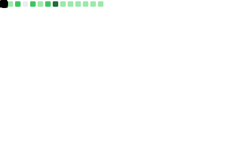

    <picture>
        
    </picture>

    <picture>
        
    </picture>

    <picture>
        
    </picture>

 

    <picture>
        
    </picture>

    <picture>
        
    </picture>

    <picture>
        
    </picture>

    <picture>
        
    </picture>

    
    &nbsp;
    
    &nbsp;
    

