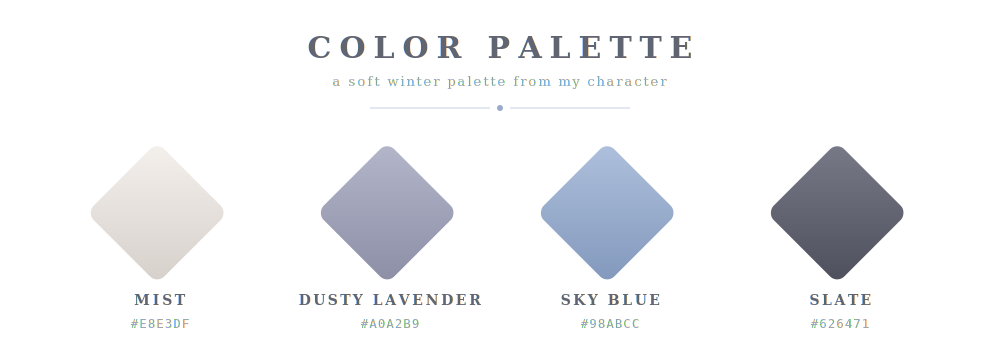

    <picture>
        
    </picture>

    <picture>
        
    </picture>

    <picture>
        <source
            media="(prefers-color-scheme: dark)"
            srcset="https://github-readme-stats.vercel.app/api?username=miniex&show_icons=true&include_all_commits=true&count_private=true&hide_border=true&border_radius=18&card_width=420&bg_color=1e1425&title_color=ffc8e0&text_color=f0d0e0&icon_color=ffb8d4&ring_color=ffb8d4"
        />
        <source
            media="(prefers-color-scheme: light)"
            srcset="https://github-readme-stats.vercel.app/api?username=miniex&show_icons=true&include_all_commits=true&count_private=true&hide_border=true&border_radius=18&card_width=420&bg_color=fff5f8&title_color=c85a80&text_color=8b3a5e&icon_color=e890b0&ring_color=e890b0"
        />
        
    </picture>
    <picture>
        <source
            media="(prefers-color-scheme: dark)"
            srcset="https://streak-stats.demolab.com?user=miniex&hide_border=true&border_radius=18&card_width=420&background=1e1425&stroke=1e1425&ring=ffb8d4&fire=ffc8e0&currStreakNum=ffb8d4&sideNums=f0d0e0&currStreakLabel=ffc8e0&sideLabels=c9a0b8&dates=c9a0b8"
        />
        <source
            media="(prefers-color-scheme: light)"
            srcset="https://streak-stats.demolab.com?user=miniex&hide_border=true&border_radius=18&card_width=420&background=fff5f8&stroke=fff5f8&ring=e890b0&fire=c85a80&currStreakNum=c85a80&sideNums=8b3a5e&currStreakLabel=c85a80&sideLabels=b06080&dates=b06080"
        />
        
    </picture>

    <picture>
        <source
            media="(prefers-color-scheme: dark)"
            srcset="https://github-readme-stats.vercel.app/api/top-langs/?username=miniex&layout=compact&langs_count=8&hide_border=true&border_radius=18&card_width=400&bg_color=1e1425&title_color=ffc8e0&text_color=f0d0e0"
        />
        <source
            media="(prefers-color-scheme: light)"
            srcset="https://github-readme-stats.vercel.app/api/top-langs/?username=miniex&layout=compact&langs_count=8&hide_border=true&border_radius=18&card_width=400&bg_color=fff5f8&title_color=c85a80&text_color=8b3a5e"
        />
        
    </picture>

    <picture>
        
    </picture>

    <picture>
        
    </picture>

    <picture>
        
    </picture>

    
    &nbsp;
    
    &nbsp;
    

